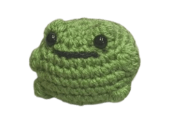

`toad` allows the use of interactive command line environments for software development and troubleshooting the host operating system, without having to install software on the host. It is built on top of [Podman](https://podman.io/) and other standard container technologies from [OCI](https://opencontainers.org/).

`toad` environments have seamless access to the user's home directory, the Wayland and X11 sockets, networking (including Avahi and CA certificates), removable devices (like USB sticks), systemd journal, SSH agent, D-Bus, ulimits, `/dev` and the udev database, etc. The host file system can be accessed at `/run/host`.

## Acknowledgements

This is a fork of [containers/toolbox](https://github.com/containers/toolbox) and as such is built off of much of their code. This project also takes great inspiration from the [Distrobox](https://distrobox.it) project.

## License

[Apache-2.0](./LICENSE)
